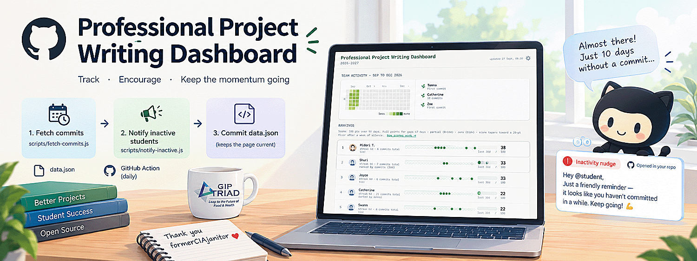

<h1 align="center" style="margin:0;">
 <a href="https://gip-triad.github.io/pp-dashboard/">
        
</h1>

 
<h3 align="center" style="margin: 0; margin-top: 0;">
A leaderboard-style dashboard that tracks student commit activity, scores their consistency, and automatically nudges anyone who's gone quiet.
</h3>
 

## How it works

Everything is driven by a scheduled GitHub Action
(`.github/workflows/fetch-commits.yml`) that runs daily and:

1. **Fetches commit data** (`scripts/fetch-commits.js`) for every student repo
   and writes the results to `data.json`, which `index.html` reads directly —
   there's no backend, it's a static page.
2. **Notifies inactive students** (`scripts/notify-inactive.js`) — see below.
3. **Commits `data.json`** back to this repo so the dashboard stays current.

## Automatic inactivity nudges

When a student hasn't committed in a while, the dashboard doesn't just show
it passively — the daily Action opens an issue directly in **that student's
own repo** to nudge them.

- **Threshold**: 10 days since last commit (`INACTIVITY_THRESHOLD_DAYS` in
  the workflow), matching the dashboard's own "everyone's active" check.
- **No duplicate spam**: it checks for an already-open issue labeled
  `inactivity-nudge` before creating a new one.
- **Self-resolving**: once the student commits again, the Action
  automatically comments and closes that issue on the next run.
- **Real @-mentions**: `data.json` doesn't store GitHub usernames directly,
  so the script resolves the student's login from the numeric GitHub user ID
  embedded in their `avatar_url` (via `GET /user/{id}`).

This runs as its own step in the same workflow, right after the commit data
is fetched, using the same `MENTOR_GITHUB_TOKEN` secret.

## Setup

- **Secret**: `MENTOR_GITHUB_TOKEN` — needs read access to fetch commits
  across student repos, and `issues: write` access on those same repos for
  the nudge step to open/close issues. See the token's scope (classic PAT:
  `repo`; fine-grained: Issues → Read and write) and confirm it's actually
  granted access to every student repo, not just the org as a whole.
- **Student repos**: expected under the `GIP-TRIAD` org, one per student, as
  listed in whatever config `fetch-commits.js` reads from.

## Files

| File | Purpose |
|---|---|
| `index.html` | The dashboard itself — static, reads `data.json` |
| `data.json` | Generated automatically — don't edit by hand |
| `.github/workflows/fetch-commits.yml` | Daily scheduled Action |
| `scripts/fetch-commits.js` | Pulls commit history into `data.json` |
| `scripts/notify-inactive.js` | Opens/closes inactivity nudge issues |